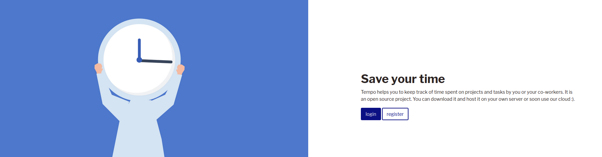
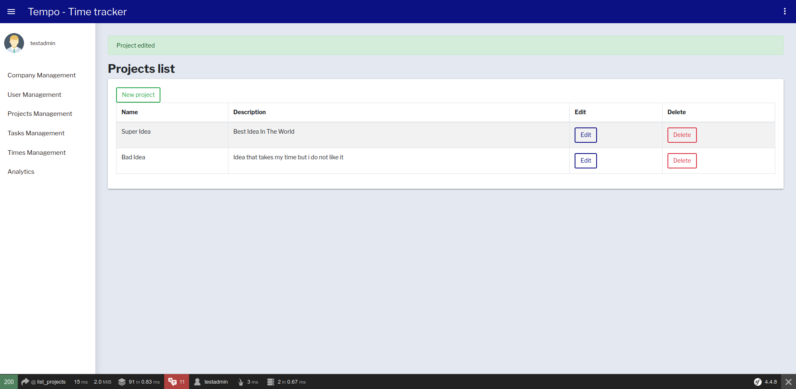
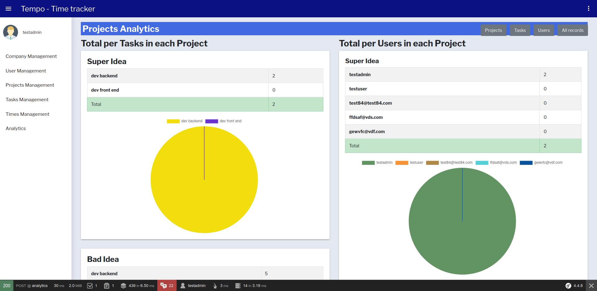

Tempo
==========

Licence: AGPL

Project : a web app to register time past on projects and tasks and analyze time spent

Developed by :
Guilhem Vilarroya (www.alteragile.com ; guilhem@alteragile.com) and 
Eric Spichiger (https://hiveweb.ch/)

HOW TO INSTALL TEMPO ?
--
Clone the project et host it on your own server.
You have to edit the .env file with your own server parameters

HOW TO USE IT ?
--
First you have to register as a Manager and create your company.
You have to register a key that will allow others people to join your company as Members.
As a Manager you can promote/demote other users from MEMBER <=> LEADER
Create Porjects and Tasks (a task can have multiple subtasks but only one mothertask)
Then all members car record times past on Projects and Tasks.

STACK
--
Symfony 4.4
Bootstrap 4
PHP 7.4
MySQL 5.7

ROLES
--
- ROLE_USER = MEMBER: record his own time, analytics of his own time
- ROLE_ADMIN = LEADER: + manage Projects, Tasks, Analytics of all Members and his own analytics 
- ROLE_SUPER_ADMIN = MANAGER: + manage roles of other users, analytics of all, manage firm account

ENTITIES
--
- USER : well, it is a user (see roles upthere)
- COMPANY : a company is a group of users. A user user belong to only one company (for the moment). A company has only one super-admin (for the moment). A company has a "day perdiod" aka the length of a working day (use in analytics)
- PROJECT : name of a project
- TASK : can have multiple subtasks and one mother taks (subtasks and mother task are TASK)
- TIME : it is startdate and endate for a project and task and user

HOW TO ENABLE THE RESET PASSWORD FUNCTION
--
1. You have to modify the line 28 of the .env file to inform your mail server
2. You can change the sender email line 18 in SecurityController.php

SOME SCREENSHOTS
--
* Login

* List of all projects

* Analytics

WHAT'S NEXT FOR v2.0?
==
* Track time in real time
* Paginate all lists
* Improve UI for analytics
* Pomodoro function

FEEL FREE to contribute or fork
--
We are developping Tempo in our free time. 

Feel free to contribute with debug or new features. 

If you want to improve UI and/or UX, you are also welcomed in the project.

Our V1.0 "project management" was a little "borderlined" and in french. We will work only in english in the future to allow non french speaker to work with us.
